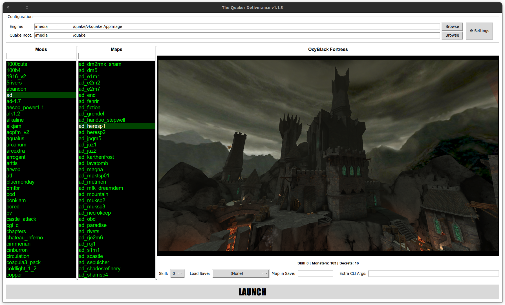

# The Quaker Deliverance
A Quake 1 launcher "Vibe Coded" in python using Google Gemini.



Features
--------
- Takes "Real Time" screenshots. 
- Launches Mods or sperate Maps.
- Supports Saved Games.
- Selectable Skill Levels.
- Shows Number of monsters and secrets per map (Change skill level to see number per skill level).
- Shows Maps full name.
- Supports themes.
- Uses mostly preinstalled python librarires for most distros (You may need to install the python pillow library for image support).
- Search Mods and Maps (Only maps for the selected Mod, I might add support to search all maps).
- When you click a Mod a random screenshot will appear.
- Saves the last Mod and Map used when closing the app.


Configuration
-------------
- Browse for Quake Engine (Executable)
- Browse for Quake base direcory

Settings
--------
- Select Theme.
- Select font size.

Launch Mod or Map
-----------------
- Select "Skill"
- Add any "Extra CLI Args" such as -heapsize , -startwindowed. CLI Args are saved on a per Mod basis. 
- Double click Mod or Map to launch. Click LAUNCH (or press "Enter").

Launch Saved Game
-----------------
- Saved games are sorted by most recent date first.
- Load a Saved Game and the app will show you a screenshot of the map from the saved game.
- Click "Load Save" to select your saved game.
- Press Enter or click Launch.

Screenshots
-----------
- When you click a Mod any existing screenshots (from before launching the app) are moved to the "oldscreenshots" directory as a backup.
- Take a screenshot using your usual key (default is F12).
- If you take a new screenshot your previous screenshot for that map will be over written.
- The application monitors the Mod directory for new screenshots, if you take a scrrsnhot it will be renaned to the map name you launched and moved to the "previews" directory.
- Right click a screenshot for an option to delete it or open the "previews" direcory for the selected Mod.

Filter
------
- You can filter for Mods and Maps by typing in the textbox at the top of each column.

Refresh Mods and Maps 
---------------------
- Right click any Mod in the Mods column
  - "Force Maps Rescan - (Clear Cache)" will scan for any new maps added to the direcory
  - "Refresh Mods List" - Will updated any Mods you have added (saves you from having to restart the app)

Simple up and running for Debian based distros
----------------------------------------------

Download using this link
https://github.com/yzf750/The-Quaker-Deliverance/archive/refs/heads/main.zip

Extract files

Copy "the-quaker-deliverance.py" and "the-quaker-deliverance-icon.png" to your Quake directory.

You may need to install the python pillow library.
```bash
sudo apt install python3-tk python3-pil.imagetk
```

In your Quake directory run 
```bash
python3 ./the-quaker-deliverance.py
```
or

Make the script executable
```bash
chmod +x ./the-quaker-deliverance.py
```
Then simply run

```bash
./the-quaker-deliverance.py
```


```bash
git clone https://github.com/yzf750/The-Quaker-Deliverance.git
cd ./The-Quaker-Deliverance
sudo apt update
# From the Pillow docs. Most major Linux distributions, including Fedora, Ubuntu and ArchLinux
# also include Pillow in packages that previously contained PIL e.g. python-imaging.
# Debian splits it into two packages, python3-pil and python3-pil.imagetk.
sudo apt install python3-tk python3-pil.imagetk
#sudo apt install python3-pil
pip install -r requirements.txt
cp the-quaker-deliverence.py thequake.png /path/to/your/quake/directory/
```

Copy or Move the-quaker-deliverance.py and thequaker.png to your Quake directory


cd "YourQuakeDirectory"

```bash
# Make script executable
chmod +x ./the-quaker-deliverence.py
./the-quaker-deliverence.py

# or run using python

python3 ./the-quaker-deliverence.py

```

More instructions and screenshots...... Coming soon.
